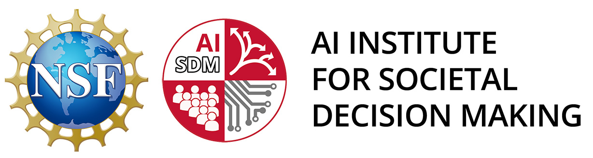
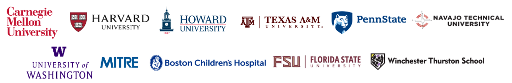

  

# NSF AI Institute for Societal Decision Making (NSF AI-SDM)

**NSF AI-SDM**, led by Carnegie Mellon University, is a multidisciplinary effort dedicated to developing human-centric AI tools that improve decision-making in high-stakes social contexts. Supported by the National Science Foundation, we focus on public health, disaster response, and community resilience.

---

## 📂 Research Directory & Resources
*The following resources are developed and maintained by AI-SDM funded labs and senior personnel.*

### 🛠️ Software, Platforms & Toolboxes
| Resource Name | Description | Source |
| :--- | :--- | :--- |
| **CORA Platform** | Red Cross Game for decision-making research | [GitHub](https://github.com/DDM-Lab/ARC_Game) |
| **Uncertainty Toolbox** | Tools for quantifying AI uncertainty | [GitHub](https://github.com/uncertainty-toolbox/uncertainty-toolbox) |
| **Causal Learning** | Python library for causal discovery | [GitHub](https://github.com/py-why/causal-learn) |
| **GAMMA** | Generative Agent Modeling for Human-AI Collaboration | [GitHub](https://github.com/lych1233/GAMMA-human-ai-collaboration) |
| **SOAP Optimizer** | High-performance optimization framework | [GitHub](https://github.com/nikhilvyas/SOAP) |
| **MOD** | Multi-Objective Decoding research | [GitHub](https://github.com/srzer/MOD) |
| **DPO Samplers** | Samplers in Online Direct Preference Optimization | [GitHub](https://github.com/srzer/samplers-in-online-dpo) |
| **Meta AI for Good** | Collaborative project with Meta AI for Good | [GitHub](https://github.com/jaylouissaint/AISDM_Meta) |

### 📊 Datasets & Field Research
| Asset | Description | Access |
| :--- | :--- | :--- |
| **CRASAR** | Center for Robot Assisted Search and Rescue | [GitHub](https://github.com/CRASAR/WiSAR/) |
| **CRASAR-U-DROIDs** | Field robotics and disaster response dataset | [HuggingFace](https://huggingface.co/datasets/CRASAR/CRASAR-U-DROIDs) |

### 🏛️ Affiliated Research Labs
| Laboratory | Institutional Focus | Home Page |
| :--- | :--- | :--- |
| **DDM Lab** | Dynamic Decision Making Lab | [Visit Lab](https://github.com/DDM-Lab) |
| **DCML Group** | Data-Centric Machine Learning | [Visit Lab](https://github.com/dcml-lab) |
| **LASI Lab** | Lab for AI and Social Impact | [Visit Lab](https://github.com/lasilab) |
| **THiCC Lab** | The Human in Computing and Cognition | [Visit Lab](https://github.com/THiCC-Lab) |
| **Kempner Institute** | Natural & Artificial Intelligence Research | [Visit Institute](https://github.com/KempnerInstitute/) |

---

### 🤝 Our Partner Network
We leverage expertise from across the nation to address complex societal challenges.

  

---

### 🌐 Dissemination & Contact
For more information on our research, publications, and data management practices:
* **Official Website:** [cmu.edu/ai-sdm](https://cmu.edu/ai-sdm)
* **LinkedIn:** [AI-SDM on LinkedIn](https://www.linkedin.com/company/ai-sdm/)
* **YouTube:** [AI-SDM on YouTube](https://www.youtube.com/@ai-sdm)
* **Contact:** Reach out to the Managing Director, Norman Gottron [ngottron@andrew.cmu.edu](mailto:ngottron@andrew.cmu.edu) with collaborative inquiries.

---

  This material is based upon work supported by the AI Research Institutes Program funded by the National Science Foundation under the AI Institute for Societal Decision Making (NSF AI-SDM), Award No. 2229881.

